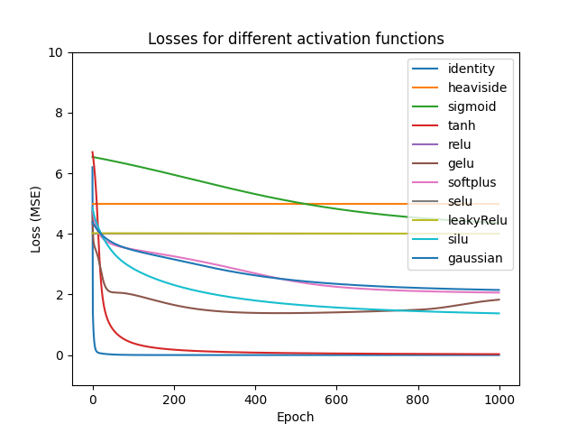

# MicroGrad

This project is a re-implementation of
[Andrej Karpathy](https://www.youtube.com/@AndrejKarpathy)'s
[micrograd](https://github.com/karpathy/micrograd) implementation, which is a
simple gradient descent engine. It's a DIY, hands-on implementation of neural
networks from the lowest (software) level.

## MicroGrad (My Version)

MicroGrad itself is an engine for consuming a particular equation (defined by
code) and arbitrarily performing both forward and backward passes. It is the
basis for neural networks, and effectively handles all of the derivation steps
of backpropagation throughout a network.

I've gone ahead and stripped some of the value-less additions of MicroGrad
(namely, a lot of the labelling) in favor of cleaning up the code. The engine
now supports more robust computations (that are probably All useless), such as
logarithms, or tracking values as power exponents.

Of more (relative) value, I've gone ahead and added a wide variety of activation
functions for multi-layered perceptrons. In total, there are eleven _unique_
non-linearity functions. Ideally, these can be compared and contrasted for
individual projects as necessary. Though these activation functions could
_potentially_ be parameterized, the architecture for micrograd does not support
this (as it's a pain to test and implement. Simply put: I don't want to do
that.)

The neural network is structured such that layers of neurons can be configured
and are always fully connected, thus creating multilayer perceptron neural
networks. A network itself can have a particular activation function specified.
I could have configured a network to allow for each node to _individually_ be
configured for a particular activation function. However, I did not do this.

## Results (Wow)

Unfortunately, MicroGrad is **horribly slow.** Go figure - Writing your own
neural network code without any GPU support with naive Python values effectively
backtracks you a dozen years in terms of the "big iron" of neural network
computation.

MicroGrad is also quite limiting in terms of what networks can be designed and
created with it, which is (in and of itself) fine. However, I was still able to
create some networks and test some interesting things.

`compareMLP.py` demonstrates the difference in activation functions between
these models. From this script we can relatively compare how the networks
"learn." All tests are done with a neural network composed of 3 input neurons,
10 in hidden layer 1, 5 in hidden layer 2, and finally 1 neuron in the output
layer.

Interesting results are gained through this comparison. Certain activation
functions perform differently compared to others; This is (relatively speaking)
intended behavior.

# License TL;DR

This project is distributed under the MIT license. This is a paraphrasing of a
[short summary](https://tldrlegal.com/license/mit-license).

This license is a short, permissive software license. Basically, you can do
whatever you want with this software, as long as you include the original
copyright and license notice in any copy of this software/source.

## What you CAN do:

-   You may commercially use this project in any way, and profit off it or the
    code included in any way;
-   You may modify or make changes to this project in any way;
-   You may distribute this project, the compiled code, or its source in any
    way;
-   You may incorporate this work into something that has a more restrictive
    license in any way;
-   And you may use the work for private use.

## What you CANNOT do:

-   You may not hold me (the author) liable for anything that happens to this
    code as well as anything that this code accomplishes. The work is provided
    as-is.

## What you MUST do:

-   You must include the copyright notice in all copies or substantial uses of
    the work;
-   You must include the license notice in all copies or substantial uses of the
    work.

If you're feeling generous, give credit to me somewhere in your projects.
